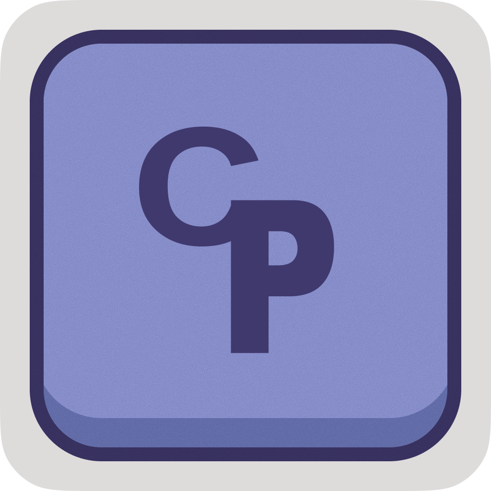

<p align="center">
  
</p>

# UCP Clipboard

[English](README_en.md)

基于 Dioxus 0.7 的跨平台桌面剪贴板历史应用。Windows 是主要验证目标；macOS 和 Linux 已尽量补齐支持，但在真实设备和发布包验证完成前仍属于实验支持。

## 功能

- 捕获文本、图片和文件剪贴板记录。
- 使用本地 SQLite 数据库存储历史和设置，数据库扩展名为 `.ucp`。
- 支持搜索文本和文件记录，并按全部、文本、图片、文件、收藏筛选。
- 支持收藏、置顶、多选删除、复制回剪贴板和可选快捷粘贴。
- 可从条目菜单将捕获的图片保存为 PNG 文件。
- 包含无边框桌面窗口、自定义窗口控制、设置页、状态栏反馈、系统托盘集成和桌面小组件模式。

## 快捷键

- `Ctrl+Shift+V`：默认全局显示窗口快捷键，可在设置中点击快捷键输入框后按下新的组合键修改。
- `Ctrl+F`：聚焦搜索。
- `Ctrl+,`：切换设置页。
- `Ctrl+1` 到 `Ctrl+5`：切换筛选。
- `ArrowUp` / `ArrowDown`：在历史列表中移动。
- `Shift+ArrowUp` / `Shift+ArrowDown`：扩展选择。
- `Ctrl+A`：选择当前可见记录。
- `Enter`：复制当前聚焦记录。
- `Delete` / `Backspace`：删除当前聚焦或已选择记录。
- `F`：切换当前聚焦记录的收藏状态。
- `P`：切换当前聚焦记录的置顶状态。
- `Escape`：清除选择、清除搜索或关闭设置页。

## 平台备注

### Windows

- 当前支持最完整、验证最多的平台。
- 使用 Windows 剪贴板事件监听，不依赖轮询。
- 支持文本、图片和文件剪贴板读写。
- 通过模拟 `Ctrl+V` 支持快捷粘贴。
- 通过当前用户的 Run 注册表项支持开机启动。
- 桌面小组件模式支持置顶、固定尺寸、隐藏任务栏入口和原生窗口透明度。

### macOS

- 实验支持。
- 文本和图片剪贴板通过 `arboard` 支持。
- 文件剪贴板通过 `osascript` JavaScript for Automation 调用 AppKit `NSPasteboard` 读写。
- 剪贴板变更检测使用 `NSPasteboard.changeCount`；macOS 没有公开的通用剪贴板事件 API，因此这是轻量的尽力监听。
- 快捷粘贴通过 System Events 发送 `Cmd+V`，可能需要授予辅助功能权限。
- 开机启动会写入 `~/Library/LaunchAgents/dev.ucp.clipboard.plist`。
- 桌面小组件模式支持固定尺寸、窗口管理器支持范围内的置顶、透明 UI 背景和跨 Space 显示。Dock 图标会保留，避免窗口不可恢复。

### Linux

- 实验支持，实际效果依赖桌面环境。
- 文本和图片剪贴板通过 `arboard` 支持。
- 文件剪贴板使用常见桌面 MIME 类型：`x-special/gnome-copied-files` 和 `text/uri-list`。
- 剪贴板事件监听优先使用 `wl-paste --watch`，回退到 `clipnotify`；两者都不可用时会回退到轮询。
- 快捷粘贴优先使用 `wtype`，回退到 `xdotool`。
- 开机启动会写入 `$XDG_CONFIG_HOME/autostart/dev.ucp.clipboard.desktop` 或 `~/.config/autostart/dev.ucp.clipboard.desktop`。
- 桌面小组件模式支持固定尺寸、透明 UI 背景、跨工作区显示，以及在 X11/GTK 支持的环境中跳过任务栏。Wayland 下取决于具体 compositor。
- 为获得最佳运行效果，建议安装：`wl-clipboard`、`clipnotify`、`wtype`，以及根据会话选择 `xclip` 或 `xdotool`。

## 系统托盘

在 Windows 上，关闭普通窗口会将应用隐藏到后台，剪贴板监听会继续运行。可通过托盘图标重新显示窗口，或选择 `退出` 完全退出应用。

在 macOS 和 Linux 上，由于托盘支持受桌面环境影响，关闭按钮会最小化窗口而不是完全隐藏。如果托盘初始化失败，UCP 会在状态栏提示。

## 开发

如果尚未安装 Dioxus CLI：

```powershell
cargo install dioxus-cli
```

使用热重载运行调试构建：

```powershell
dx serve --platform desktop
```

`dx serve` 会在 debug 模式下启用 RSX 热重载和 Subsecond 热补丁。不需要热重载时可使用 `cargo run`。

运行测试和 lint：

```powershell
cargo test
cargo clippy --all-targets -- -D warnings
```

## 数据存储

Windows:

```text
%LOCALAPPDATA%\UCP Clipboard\history.ucp
```

macOS:

```text
~/Library/Application Support/UCP Clipboard/history.ucp
```

Linux:

```text
$XDG_DATA_HOME/UCP Clipboard/history.ucp
```

如果 Linux 未设置 `$XDG_DATA_HOME`，UCP 会回退到 `~/.local/share/UCP Clipboard/history.ucp`。如果平台相关环境变量不可用，则回退到当前目录。

## 开源协议

本项目基于 [MIT License](LICENSE) 开源。
